# 📊 Rangkuman Lengkap: *How to Get Rich (Every Episode)*
### Naval Ravikant & Babak Nivi
> **Sumber:** [YouTube — https://youtu.be/1-TZqOsVCNM](https://youtu.be/1-TZqOsVCNM)
> **Durasi:** ±3,5 jam | **Format:** Podcast / Percakapan mendalam

---

## 🗂️ Daftar Isi

1. [Latar Belakang](#latar-belakang)
2. [BAGIAN 1 — Uang & Kekayaan](#bagian-1--uang--kekayaan)
3. [BAGIAN 2 — Kewirausahaan](#bagian-2--kewirausahaan)
4. [BAGIAN 3 — Leverage (Daya Ungkit)](#bagian-3--leverage-daya-ungkit)
5. [BAGIAN 4 — Keterampilan Penting](#bagian-4--keterampilan-penting)
6. [BAGIAN 5 — Di Luar Kekayaan: Kesehatan & Kebahagiaan](#bagian-5--di-luar-kekayaan-kesehatan--kebahagiaan)
7. [Formula Utama Kekayaan](#formula-utama-kekayaan)
8. [Ringkasan Chapter & Timestamp](#ringkasan-chapter--timestamp)

---

## Latar Belakang

Video ini merupakan kompilasi lengkap semua episode dari **The Naval Podcast**, sebuah percakapan antara **Naval Ravikant** (pendiri AngelList, investor, dan filsuf modern) dengan **Babak Nivi** (co-foundernya). Isi videonya merupakan pendalaman dari *tweetstorm* viral Naval tahun 2018 yang berjudul **"How to Get Rich (without getting lucky)"**.

Menurut Naval, judul yang lebih tepat seharusnya adalah **"How to Create Wealth"**, karena ini bukan tentang menang lotre — melainkan tentang membangun *skill set* yang bisa dipelajari siapa saja.

> **Prinsip Inti:** Menciptakan kekayaan adalah sebuah *keterampilan*, bukan keberuntungan. Siapa pun yang memiliki tubuh sehat, pikiran waras, dan keinginan untuk bekerja bisa mempelajarinya.

---

## Alur Keseluruhan Konsep

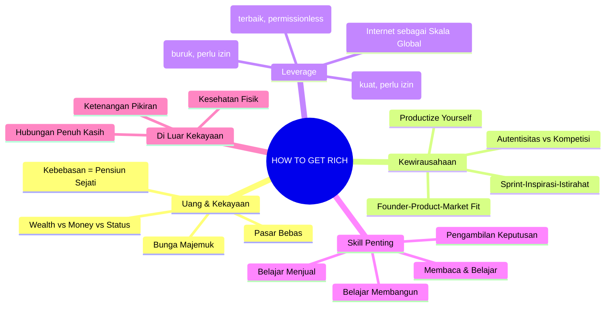

---

## BAGIAN 1 — Uang & Kekayaan

### 1.1 Kekayaan ≠ Uang ≠ Status

Naval membedakan tiga hal yang sering dikacaukan:

| Konsep | Definisi | Sifat | Kualitas |
|--------|----------|-------|----------|
| **Wealth (Kekayaan)** | Aset yang menghasilkan uang saat kamu tidur | Positif-sum | Sangat diinginkan |
| **Money (Uang)** | Alat transfer kekayaan; kredit sosial | Netral | Diperlukan tapi bukan tujuan |
| **Status (Status)** | Posisimu dalam hierarki sosial | Zero-sum | Berbahaya jika dikejar |

**Mengapa mengejar status berbahaya?** Karena status adalah permainan *zero-sum* — jika kamu naik, seseorang harus turun. Ini menciptakan permusuhan. Kekayaan sebaliknya adalah *positive-sum*: semakin banyak orang kaya, semakin baik bagi semua.

---

### 1.2 Pasar Bebas Adalah Sifat Manusia

Manusia adalah satu-satunya spesies yang bekerja sama melampaui batas genetis. Konsep pertukaran dan pencatatan kredit/debit tertanam dalam DNA kita sebagai makhluk sosial yang fleksibel. Pasar bebas bukan konstruksi buatan — ini adalah ekspresi alami dari sifat manusia yang kooperatif.

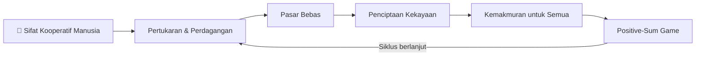

---

### 1.3 Mengapa Tidak Bisa Kaya dengan Menjual Waktu

Ini adalah salah satu poin paling krusial dalam keseluruhan video:

**Masalah utama kerja tradisional:**
- **Input sangat terikat dengan output** — jika kamu berhenti bekerja, penghasilan berhenti
- Kamu tidak bisa mendapatkan penghasilan *non-linear*
- Skalanya terbatas oleh jam yang ada dalam sehari (maksimal 24 jam)

**Solusinya:** Cari pekerjaan, karier, atau profesi di mana **input TIDAK setara dengan output**. Semakin tinggi komponen kreativitas, semakin besar kemungkinan disconnection ini terjadi.

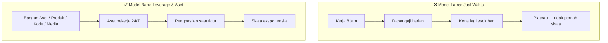

---

### 1.4 Bunga Majemuk (*Compound Interest*)

Naval berpendapat semua kebaikan dalam hidup datang dari **bunga majemuk** — tidak hanya di keuangan, tapi di semua bidang:

- **Hubungan:** kepercayaan yang terbangun selama bertahun-tahun
- **Pembelajaran:** pengetahuan yang saling melengkapi dan menguat
- **Investasi:** uang yang menghasilkan uang
- **Reputasi:** kredibilitas yang tumbuh seiring waktu

#### Grafik Konseptual Bunga Majemuk vs. Linear

```
Nilai
 │
 │                                          ╭───── Compound
 │                                    ╭────╯
 │                              ╭────╯
 │                        ╭────╯
 │                  ╭────╯
 │           ──────────────────────────── Linear
 │     ╭────╯
 │────╯
 └─────────────────────────────────────────── Waktu
      1    2    4    8   12   16   20 tahun
```

**Rumus Bunga Majemuk (konteks keuangan):**

$$A = P \times \left(1 + \frac{r}{n}\right)^{n \times t}$$

| Variabel | Keterangan |
|----------|------------|
| $A$ | Nilai akhir / total akumulasi |
| $P$ | Principal / modal awal yang ditanamkan |
| $r$ | Suku bunga tahunan (dalam desimal; misal 10% = 0.10) |
| $n$ | Frekuensi penggabungan bunga per tahun (bulanan = 12, tahunan = 1) |
| $t$ | Durasi waktu dalam tahun |

**Contoh:** Rp 100 juta diinvestasikan selama 20 tahun pada 10% per tahun:
$$A = 100.000.000 \times (1 + 0.10)^{20} = 100.000.000 \times 6.7275 = \text{Rp 672.750.000}$$

> **Insight Naval:** Kekayaannya tidak datang dari satu "big payout" besar, melainkan dari akumulasi banyak hal kecil yang terus bertumpuk — aset, bisnis, investasi, opsi.

---

### 1.5 Kebebasan = "Pensiun" Sejati

**Tujuan kekayaan adalah kebebasan** — tidak lebih dari itu. Bukan untuk membeli barang mewah, tapi untuk tidak terikat:
- Pada waktu tertentu
- Pada tempat tertentu
- Pada pekerjaan yang tidak kamu inginkan

**Syarat mutlak:** Kamu harus **memiliki ekuitas** — bagian dari bisnis — untuk mencapai kebebasan finansial. Seseorang yang hanya bekerja untuk orang lain tidak akan pernah benar-benar bebas secara finansial.

---

### 1.6 Hidup Di Bawah Kemampuan untuk Kebebasan

Orang yang hidup **jauh di bawah standar hidup yang mereka mampu** menikmati tingkat kebebasan yang tidak bisa dibayangkan oleh mereka yang terus-menerus meng-upgrade gaya hidup mereka.

**Jebakan upgrade gaya hidup (*lifestyle creep*):**

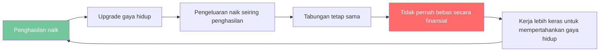

---

## BAGIAN 2 — Kewirausahaan

### 2.1 *Productize Yourself* — Jadikan Dirimu Produk

Ini adalah salah satu konsep paling ikonik dari Naval, yang bisa dirumuskan menjadi dua kata: **"Productize Yourself."**

- **"Productize"** → memiliki *specific knowledge* dan *leverage*
- **"Yourself"** → memiliki keunikan dan akuntabilitas

**Artinya:** Jadilah begitu khas dalam hal yang kamu lakukan sehingga tidak ada yang bisa bersaing denganmu — karena kamu **adalah** produknya.

> Idealnya, kamu akan berakhir dengan spesialisasi dalam *menjadi dirimu sendiri*. Penghasilan adalah fungsi dari identitasmu dan apa yang kamu sukai.

---

### 2.2 Formula Hasil Akhir (Nivi's Equation)

Babak Nivi, co-founder Naval di AngelList, merumuskan persamaan kekayaan sebagai berikut:

$$\text{Hasil Akhir} = SK \times L \times J \times A \times SV \times C(t)$$

| Variabel | Nama Lengkap | Penjelasan |
|----------|-------------|------------|
| $SK$ | *Specific Knowledge* | Seberapa unik dan tidak bisa digantikan pengetahuanmu |
| $L$ | *Leverage* | Seberapa besar daya ungkit yang bisa kamu gunakan (kapital, kode, media, tenaga) |
| $J$ | *Judgment* | Seberapa sering penilaianmu benar dalam membuat keputusan penting |
| $A$ | *Accountability* | Seberapa besar kamu sendiri yang bertanggung jawab atas hasil |
| $SV$ | *Society Value* | Seberapa besar masyarakat menghargai apa yang kamu kerjakan |
| $C(t)$ | *Compound over Time* | Berapa lama kamu bisa terus melakukannya + terus meningkat melalui pembelajaran |

> **Insight:** Semua variabel ini saling mengalikan (*multiply*), bukan menjumlahkan. Jika salah satu mendekati nol, seluruh hasil mendekati nol.

---

### 2.3 *Founder–Product–Market Fit*

Naval menekankan bahwa tujuan terpenting seorang wirausahawan adalah menemukan **kesesuaian tiga arah** ini:

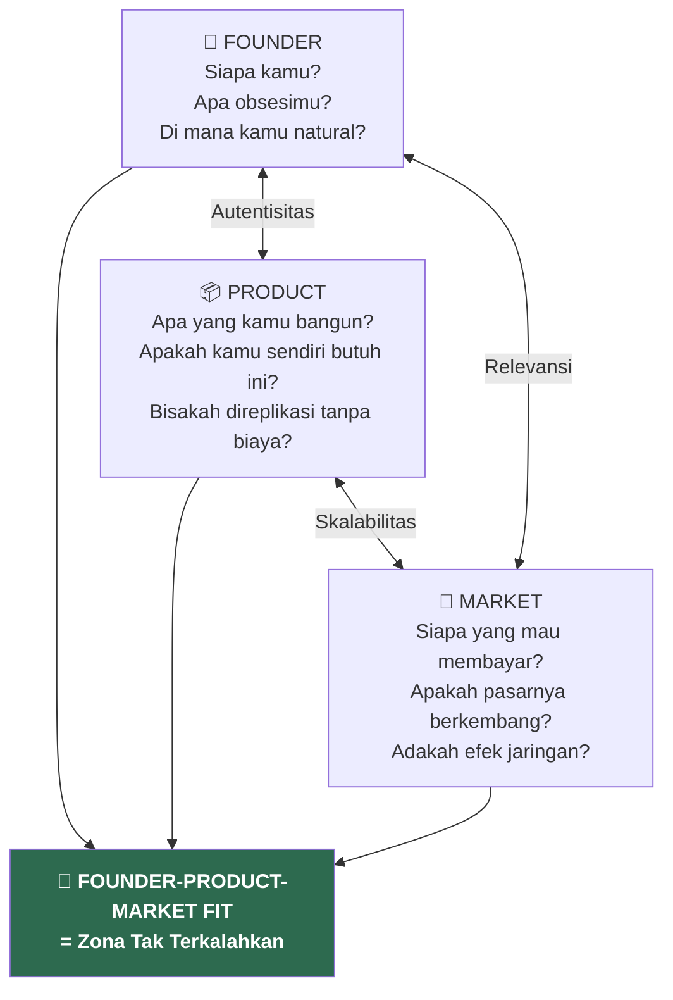

**Tiga pertanyaan panduan:**

**Untuk Founder (Dirimu):**
- Apa yang aku obsesikan?
- Di mana aku secara alami berbakat?
- Di mana perpaduan unik keterampilanku?

**Untuk Product:**
- Produk apa yang akan kubuat karena aku sendiri membutuhkannya?
- Apakah ini bisa direplikasi tanpa biaya marginal?

**Untuk Market:**
- Di mana pasar sedang tumbuh?
- Apakah ada efek jaringan (*network effects*)?

---

### 2.4 Hindari Kompetisi Lewat Autentisitas

**Prinsip kunci:** Semakin autentik kamu terhadap dirimu sendiri, semakin sedikit kompetisi yang kamu hadapi.

Jika kamu membangun sesuatu yang benar-benar merupakan ekspresi dari siapa dirimu, **tidak ada yang bisa bersaing denganmu** — karena tidak ada orang lain yang bisa menjadi kamu.

```mermaid
quadrantChart
    title Posisi Kompetitif Berdasarkan Autentisitas & Keahlian
    x-axis Keahlian Rendah --> Keahlian Tinggi
    y-axis Tidak Autentik --> Sangat Autentik
    quadrant-1 Zona Ideal (Unik & Ahli)
    quadrant-2 Mudah Ditiru
    quadrant-3 Komoditas
    quadrant-4 Bisa Digantikan
    Kamu (autentik + ahli): [0.85, 0.90]
    Pekerja generik: [0.30, 0.20]
    Spesialis tanpa identitas: [0.75, 0.25]
    Kreatif tanpa keahlian: [0.20, 0.70]
```

---

### 2.5 Siklus Inspirasi–Sprint–Istirahat

Cara paling efektif bekerja, terutama dalam *knowledge work*:

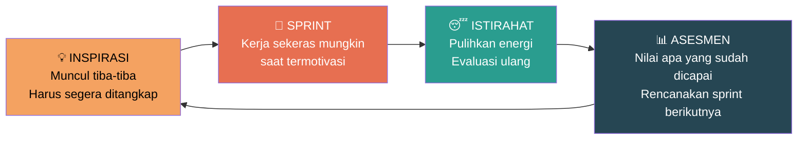

**Prinsip:** *"Impatience with actions, patience with results."*
Tindakan: lakukan segera dan sepenuh hati. Hasil: butuh waktu, bersabarlah.

> Bekerja 80–120 jam/minggu hanyalah *status signaling*. Tidak ada yang benar-benar bisa bekerja dengan output tinggi dan kejernihan mental selama itu. Otak akan rusak.

---

## BAGIAN 3 — Leverage (Daya Ungkit)

### 3.1 Apa itu Leverage?

Kita hidup di era **leverage yang hampir tak terbatas**, dan hampir semua kekayaan besar diciptakan melalui leverage.

**Definisi sederhana:** Leverage adalah **pengganda kekuatan untuk penilaianmu** (*judgment*).

$$\text{Output} = \text{Kemampuan Dasar} \times \text{Leverage}$$

Tanpa leverage: satu jam kerja = satu jam hasil.
Dengan leverage: satu jam kerja = ribuan/jutaan jam hasil.

---

### 3.2 Tiga Bentuk Leverage

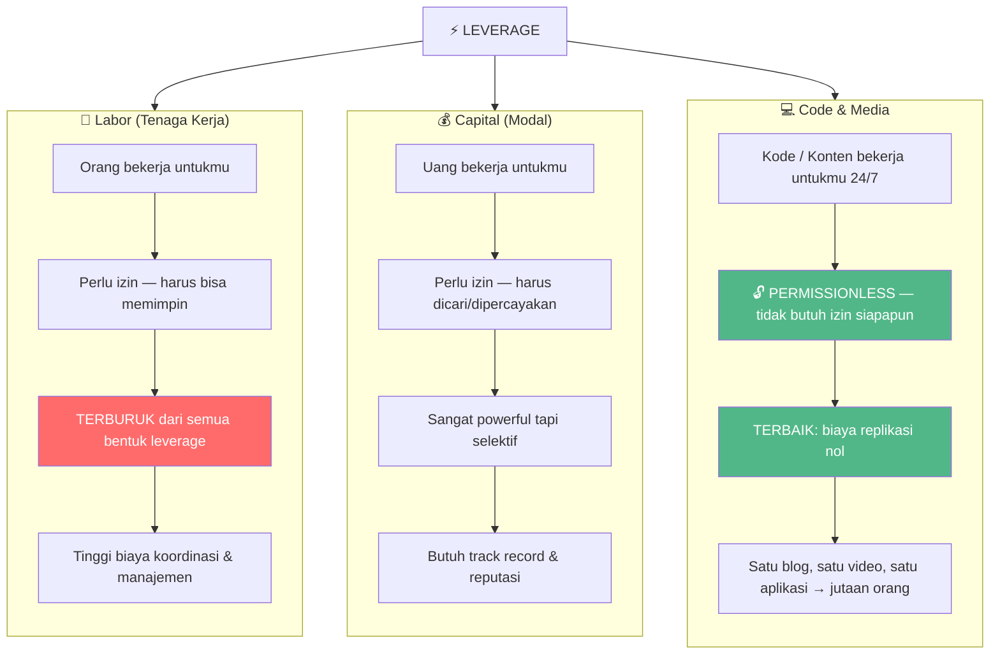

| Bentuk | Contoh | Perlu Izin? | Skalabilitas | Rekomendasi |
|--------|--------|-------------|--------------|-------------|
| **Labor** | Karyawan, tim | Ya (kepercayaan) | Terbatas | ⚠️ Hindari |
| **Capital** | Saham, investasi, iklan | Ya (investor/bank) | Tinggi | 🟡 Gunakan setelah kuat |
| **Code** | Aplikasi, SaaS, skrip | **Tidak** | **Tak terbatas** | ✅ Prioritaskan |
| **Media** | Blog, podcast, video, buku | **Tidak** | **Tak terbatas** | ✅ Prioritaskan |

> "Jika kamu tidak bisa kode, tulis buku dan blog, rekam video dan podcast. Kamu tidak butuh izin siapapun."

---

### 3.3 Kekuatan Internet sebagai Skala

Internet menghubungkan **setiap manusia ke setiap manusia lain di planet ini**. Ini adalah *superpowernya*.

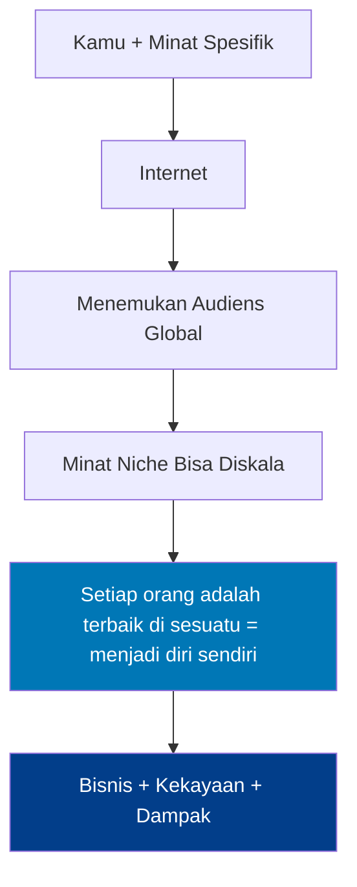

---

### 3.4 Akuntabilitas (*Accountability*)

Akuntabilitas adalah cara kamu mendapatkan leverage, kredibilitas, dan ekuitas.

- Terima tanggung jawab dan ambil risiko bisnis **atas nama sendiri**
- Anggap akuntabilitas sebagai ***reputational skin in the game*** — menaruhkan nama baikmu sebagai taruhan
- Jika kamu memecahkan masalah di tepi batas pengetahuan yang orang lain tidak bisa, orang akan berbaris di belakangmu

> **Akuntabilitas adalah sesuatu yang bisa kamu ambil sekarang juga.** Judgment dan leverage datang belakangan.

---

### 3.5 Judgment (Penilaian)

Di era leverage tak terbatas, **judgment menjadi keterampilan paling penting**.

$$\text{Leverage} = \text{Pengganda untuk Judgment-mu}$$

**Artinya:** Leverage yang besar dengan judgment yang buruk = *bencana besar*. Leverage yang besar dengan judgment yang baik = *kekayaan besar*.

**Bagaimana membangun judgment:**
1. Ambil akuntabilitas → dapatkan pengalaman → bangun judgment
2. Pelajari *first principles* (prinsip-prinsip dasar)
3. Semakin panjang cakrawala waktumu (*time horizon*), semakin bijaksana keputusanmu

---

### 3.6 *Specific Knowledge* (Pengetahuan Spesifik)

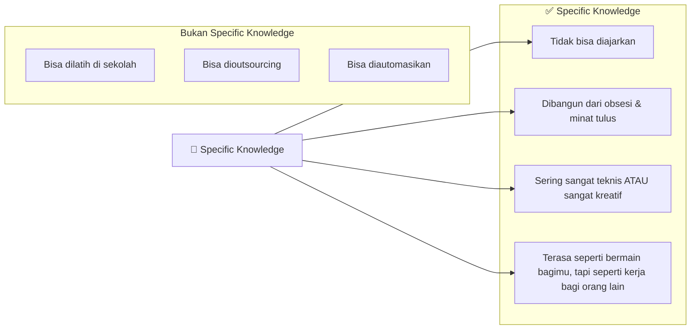

**Dua tipe Specific Knowledge:**

| Tipe | Deskripsi | Contoh |
|------|-----------|--------|
| **Timeless** | Tidak bisa diajarkan, melekat selamanya | Kemampuan bercerita, kemampuan memimpin |
| **Timely** | Datang dan pergi, tapi shelf life panjang | Machine learning (2024), blockchain (2017-2020) |

**Cara menemukannya:** Lihat ke belakang dalam hidupmu — **apa yang secara konsisten kamu lakukan lebih baik dan lebih mudah dari orang lain?**

---

## BAGIAN 4 — Keterampilan Penting

### 4.1 Belajar Menjual + Belajar Membangun

Naval menyatakan ini adalah **kombinasi keterampilan paling powerful** yang bisa dimiliki seseorang:

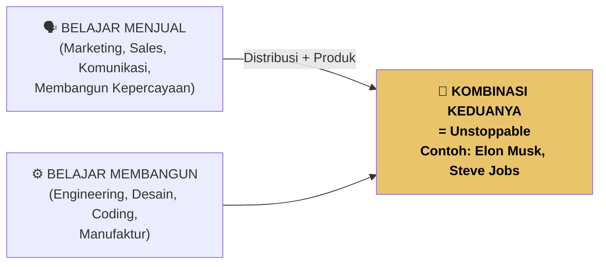

**Mengapa kombinasi ini langka dan powerful?**
- Kebanyakan builder tidak bisa menjual
- Kebanyakan salesperson tidak bisa membangun
- Jika kamu bisa melakukan keduanya: kamu tidak butuh orang lain untuk memulai

---

### 4.2 Membaca & Pembelajaran

Naval adalah pembaca maniak. Prinsip-prinsip membacanya:

1. **Baca apa yang kamu cintai** sampai kamu mencintai membaca — jangan paksa
2. **Buku foundational > buku terbaru** — baca Darwin bukan ringkasan evolusi terkini
3. **Pilih buku klasik:** *Feynman's Six Easy Pieces*, *Skin in the Game* (Taleb), *The Origin of Species*
4. **Pahami prinsip dasar, bukan tren** — tren berubah, prinsip bertahan

---

### 4.3 Pengambilan Keputusan (*Decision Making*)

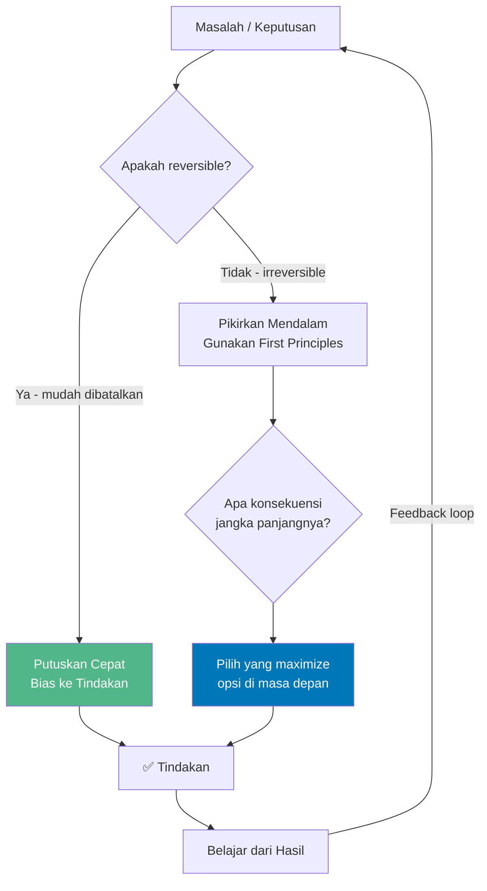

**Prinsip-prinsip pengambilan keputusan Naval:**

- **Ergodisitas:** Apa yang benar untuk rata-rata 100 orang tidak sama dengan satu orang yang melakukan hal yang sama 100 kali. *Jangan berjudi dengan sesuatu yang tidak bisa kamu ulangi berkali-kali.*
- **Jangka panjang > jangka pendek:** Pilih keputusan yang memperluas pilihan di masa depan
- **Reputasi sebagai aset:** Sekali rusak, hampir seperti kembali ke nol
- **Schelling Points:** Dalam situasi yang tidak bisa dikomunikasikan, pilih solusi yang paling *obvious* dan bisa dikoordinasikan

---

## BAGIAN 5 — Di Luar Kekayaan: Kesehatan & Kebahagiaan

### 5.1 Tiga Hal yang Tidak Bisa Dibeli Uang

Ini adalah penutup yang paling profound dari seluruh video:

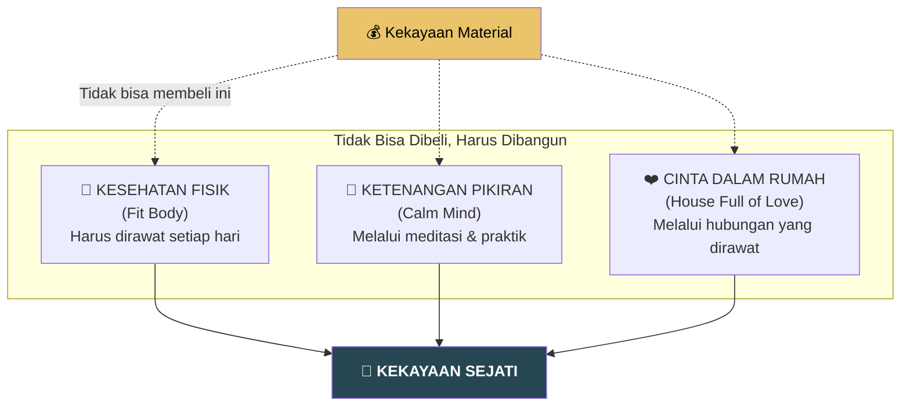

> Ketiga hal ini tidak bisa dibeli — harus **diraih dan dirawat**. Ketiganya akan memberikan kedamaian dan kebahagiaan yang jauh melebihi jumlah uang manapun.

---

### 5.2 Tentang Kebahagiaan & Kekayaan

Ketika seseorang akhirnya mencapai kekayaan yang diidamkan, menurut Naval hal pertama yang disadari adalah:

**Kamu masih orang yang sama.**
- Jika kamu bahagia → kamu tetap bahagia
- Jika kamu tidak bahagia → kamu tetap tidak bahagia (hanya dengan masalah yang lebih mahal)

Uang hanya akan memecahkan **masalah uang**. Tidak lebih, tidak kurang.

---

### 5.3 Meditasi & Ketenangan Pikiran

Naval sangat mengadvokasi meditasi bukan sebagai praktik spiritual, tapi sebagai **teknologi untuk pikiran yang jernih**:

- Pikiran dan kalender yang penuh akan **menghancurkan kemampuanmu melakukan hal-hal besar**
- Untuk melakukan sesuatu yang besar, kamu butuh **waktu bebas dan pikiran yang bebas**
- *"Kamu harus terlalu sibuk untuk 'ngopi-ngopi', tapi tetap punya kalender yang tidak padat."*

---

## Formula Utama Kekayaan

### Ringkasan Semua Prinsip dalam Satu Kerangka

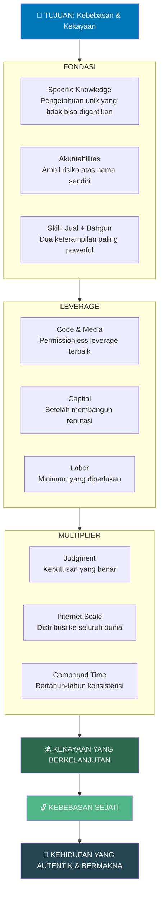

---

## Ringkasan Chapter & Timestamp

| # | Judul Chapter | Timestamp | Tema Utama |
|---|---------------|-----------|------------|
| 1 | Seek Wealth, Not Money or Status | 1:30 | Definisi kekayaan vs uang vs status |
| 2 | Make Abundance for the World | 6:40 | Kekayaan adalah positive-sum game |
| 3 | Free Markets Are Intrinsic to Humans | ~11:00 | Pasar bebas sebagai sifat alami manusia |
| 4 | Ethical Wealth Creation Is Possible | ~15:00 | Menciptakan kekayaan secara etis |
| 5 | Envy Can Eat You Alive | ~18:00 | Bahaya iri hati dalam permainan zero-sum |
| 6 | Live Below Your Means for Freedom | ~22:00 | Kebebasan dari lifestyle creep |
| 7 | The Real Wealth | ~26:00 | Kesehatan, pikiran, cinta |
| 8 | Productize Yourself | ~30:00 | Jadikan dirimu produk unik |
| 9 | Escape Competition Through Authenticity | ~38:00 | Autentisitas sebagai keunggulan kompetitif |
| 10 | Keep Redefining What You Do | ~44:00 | Terus definisikan ulang keunggulanmu |
| 11 | Arm Yourself With Specific Knowledge | ~52:00 | Membangun pengetahuan spesifik |
| 12 | Specific Knowledge Is Highly Creative or Technical | ~58:00 | Karakter specific knowledge |
| 13 | Learn to Sell, Learn to Build | ~1:05:00 | Dua keterampilan paling berharga |
| 14 | Read What You Love Until You Love to Read | ~1:12:00 | Pendekatan membaca Naval |
| 15 | Become the Best in the World at What You Do | ~1:20:00 | Redefinisi terus-menerus |
| 16 | There Are No Get-Rich-Quick Schemes | ~1:28:00 | Tidak ada jalan pintas |
| 17 | What is Leverage? | ~1:35:00 | Pengenalan konsep leverage |
| 18 | Labor and Capital Are Old Leverage | ~1:42:00 | Leverage tradisional |
| 19 | Code and Media Are New Leverage | ~1:50:00 | Leverage baru yang permissionless |
| 20 | Find a Position of Leverage | ~1:58:00 | Cara mendapatkan posisi leverage |
| 21 | Judgment | ~2:05:00 | Pentingnya judgment di era leverage |
| 22 | The Wisdom of Nassim Taleb | ~2:12:00 | Ergodisitas, skin in the game |
| 23 | Account for Yourself | ~2:18:00 | Akuntabilitas personal |
| 24 | Be Too Busy to 'Do Coffee' | ~2:25:00 | Manajemen waktu & kalender bersih |
| 25 | Set and Enforce an Aspirational Personal Rate | ~2:30:00 | Hargai waktumu sendiri |
| 26 | Compounding Relationships | ~2:38:00 | Hubungan sebagai compound interest |
| 27 | Price Discrimination | ~2:45:00 | Strategi penetapan harga |
| 28 | Equity Is Creation | ~2:52:00 | Ekuitas sebagai inti kekayaan |
| 29 | Hire People Overqualified for Specific Knowledge | ~3:00:00 | Membangun tim |
| 30 | Positive-Sum Games | ~3:05:00 | Pilih permainan yang positive-sum |
| 31 | Learning Is Leverage | ~3:10:00 | Pembelajaran sebagai leverage |
| 32 | Finding Time to Invest in Yourself | ~3:18:00 | Prioritaskan pengembangan diri |

---

## 💡 10 Kutipan & Prinsip Paling Penting

> *(Diparafrasikan dari isi video, bukan kutipan verbatim)*

1. **"Kamu tidak akan kaya dengan menjual waktumu."** — Putuskan koneksi antara input dan output.

2. **"Miliki ekuitas — bagian dari bisnis — untuk mencapai kebebasan finansial."** — Karyawan tidak akan pernah benar-benar bebas secara finansial.

3. **"Bangun pengetahuan spesifik yang terasa seperti bermain bagimu tapi tampak seperti kerja keras bagi orang lain."** — Ini tanda kamu di jalur yang benar.

4. **"Hindari kompetisi melalui autentisitas."** — Tidak ada yang bisa bersaing denganmu dalam hal menjadi dirimu sendiri.

5. **"Di era leverage tak terbatas, judgment adalah keterampilan paling berharga."** — Leverage mengalikan judgment — baik maupun buruk.

6. **"Kode dan media adalah leverage baru yang tidak membutuhkan izin siapapun."** — Demokratisasi kekayaan di era digital.

7. **"Sabar dengan hasil, tidak sabar dengan tindakan."** — Bertindak segera, bersabar menunggu buah hasilnya.

8. **"Semua kebaikan dalam hidup datang dari bunga majemuk."** — Berlaku untuk uang, hubungan, belajar, dan reputasi.

9. **"Tubuh sehat, pikiran tenang, dan rumah penuh cinta tidak bisa dibeli — harus dibangun."** — Kekayaan sejati bukan tentang angka di rekening.

10. **"Tujuan kekayaan adalah kebebasan — tidak lebih dari itu."** — Bukan gaya hidup mewah, tapi kedaulatan atas hidupmu sendiri.

---

*Dibuat dari sumber publik: podcastnotes.org, sloww.co, nav.al, dan referensi lainnya tentang "How to Get Rich: Every Episode" by Naval Ravikant.*
